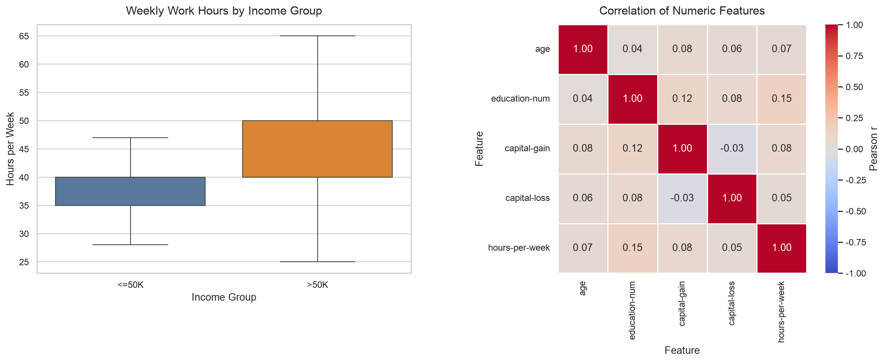

# Day2 종합실습 - Adult Census Income 분석 리포트 (팀 통합본)

이 리포트는 `final/main.py` 실행 결과를 바탕으로 자동 생성되었습니다.
팀원 6명의 구현을 spec.md 기준으로 비교해 항목별 최우수 구현을 조합한 최종본입니다
(세부 채택 근거는 `MERGE_NOTES.md` 참고).
데이터셋: [Adult Census Income](https://archive.ics.uci.edu/ml/machine-learning-databases/adult/adult.data)

## 1. 데이터 준비

### 1-1. Pandas vs Polars 로딩 비교

| | Pandas | Polars |
|---|---|---|
| 로딩 시간 | 0.0229초 | 0.0454초 |
| shape | (32561, 15) | (32561, 15) |
| 중복행 | 24건 | 24건 |

원본 결측치: `workclass` 1836건, `occupation` 1843건, `native-country` 583건

(Pandas·Polars 결과가 shape·결측치·중복행 수까지 완전히 일치함을 코드 내 assert로 검증했습니다 —
콤마+공백으로 인한 Polars의 숫자 컬럼 String 오분류, UCI 원본 파일 끝 trailing blank line으로 인한
행 수 불일치를 모두 로딩 단계에서 직접 처리했기 때문입니다.)

### 1-2. 결측치·중복 처리 (spec.md 규칙: 최빈값 대체, 중복행 제거)

- `workclass`: 1,836건 → 0건 (대체값: `Private`)
- `occupation`: 1,843건 → 0건 (대체값: `Prof-specialty`)
- `native-country`: 583건 → 0건 (대체값: `United-States`)

- 중복행 제거: 32,561행 → 32,537행 (24건 제거)

### 1-3. income 클래스 비율 (불균형 확인)

- `<=50K`: 75.91%
- `>50K`: 24.09%

> `<=50K`가 다수 클래스라 ML 평가 시 accuracy만으로는 부족해 F1도 함께 확인했고,
> train_test_split에도 stratify=income을 적용했습니다.

## 2. 시각화

| 카테고리 | 라이브러리 | 내용 | 파일 |
|---|---|---|---|
| 그룹비교+상관관계 (필수) | Seaborn | (좌) income별 근무시간 박스플롯 (우) 수치형 5개 상관 히트맵 | [eda_chart_seaborn.png](eda_chart_seaborn.png) |
| 그룹비교 (필수) | Plotly | 학력×income별 평균 근무시간 그룹 막대 | [eda_chart_plotly.html](eda_chart_plotly.html) |

> Plotly 인터랙티브 차트는 이미지로 표시되지 않으니 위 링크를 눌러 직접 열어서 확인하세요.

## 3. 통계 분석

### 3-1. 기술통계 (평균·표준편차·분위수)

|  | age | education-num | capital-gain | capital-loss | hours-per-week |
|---|---|---|---|---|---|
| count | 32537.0000 | 32537.0000 | 32537.0000 | 32537.0000 | 32537.0000 |
| mean | 38.5855 | 10.0818 | 1078.4437 | 87.3682 | 40.4403 |
| std | 13.6380 | 2.5716 | 7387.9574 | 403.1018 | 12.3469 |
| min | 17.0000 | 1.0000 | 0.0000 | 0.0000 | 1.0000 |
| 25% | 28.0000 | 9.0000 | 0.0000 | 0.0000 | 40.0000 |
| 50% | 37.0000 | 10.0000 | 0.0000 | 0.0000 | 40.0000 |
| 75% | 48.0000 | 12.0000 | 0.0000 | 0.0000 | 45.0000 |
| max | 90.0000 | 16.0000 | 99999.0000 | 4356.0000 | 99.0000 |

### 3-2. 상관계수 행렬

|  | age | education-num | capital-gain | capital-loss | hours-per-week |
|---|---|---|---|---|---|
| age | 1.0000 | 0.0360 | 0.0780 | 0.0580 | 0.0690 |
| education-num | 0.0360 | 1.0000 | 0.1230 | 0.0800 | 0.1480 |
| capital-gain | 0.0780 | 0.1230 | 1.0000 | -0.0320 | 0.0780 |
| capital-loss | 0.0580 | 0.0800 | -0.0320 | 1.0000 | 0.0540 |
| hours-per-week | 0.0690 | 0.1480 | 0.0780 | 0.0540 | 1.0000 |

### 3-3. t-test : income(<=50K vs >50K) 그룹의 hours-per-week 평균 차이 (Welch's t-test, equal_var=False)

- `<=50K` 그룹 평균: 38.84시간 (n=24,698)
- `>50K` 그룹 평균: 45.47시간 (n=7,839)
- t-statistic = -45.0950, p-value = 0
- 해석: p-value < 0.05 → 두 income 그룹의 평균 근무시간 차이는 **통계적으로 유의미하다**.

## 4. ML Pipeline

- 모델: `RandomForestClassifier` (ColumnTransformer + Pipeline, 결측 방어용 SimpleImputer 포함)
- feature: `age`, `education-num`, `capital-gain`, `capital-loss`, `hours-per-week`, `workclass`, `education`, `marital-status`, `occupation`, `relationship`, `race`, `sex`, `native-country` (fnlwgt·income 제외 — 데이터 누수 없음)
- train/test: 26,029건 / 6,508건 (test_size=0.2, random_state=42, stratify=income)
- **Accuracy = 0.8657**
- **F1-score = 0.6749**
- 모델 저장 경로: `/Users/kwngus2/Desktop/SKALA_실습과제/team_gobp/SKALA_Project_AIOps/final/model.joblib`
- joblib 재로딩 검증: 저장 후 다시 불러온 모델의 예측 확률이 `np.allclose` 기준으로 원본과 일치함을 확인했습니다.

## 5. 핵심 인사이트

- `>50K` 그룹의 평균 근무시간이 6.6시간 더 길며, 이 차이는 t-test 결과 통계적으로 유의미하다 (p=0).
- 수치형 변수 중 `education-num`와(과) `hours-per-week`의 상관계수가 0.148로 가장 크며, 나머지 변수쌍은 대체로 상관이 약해 서로 독립적인 정보를 담고 있는 것으로 보인다.

---
*이 문서는 `generate_report()` 함수에 의해 자동 생성되었습니다. 수동 편집 없이 스크립트 재실행만으로 갱신됩니다.*
