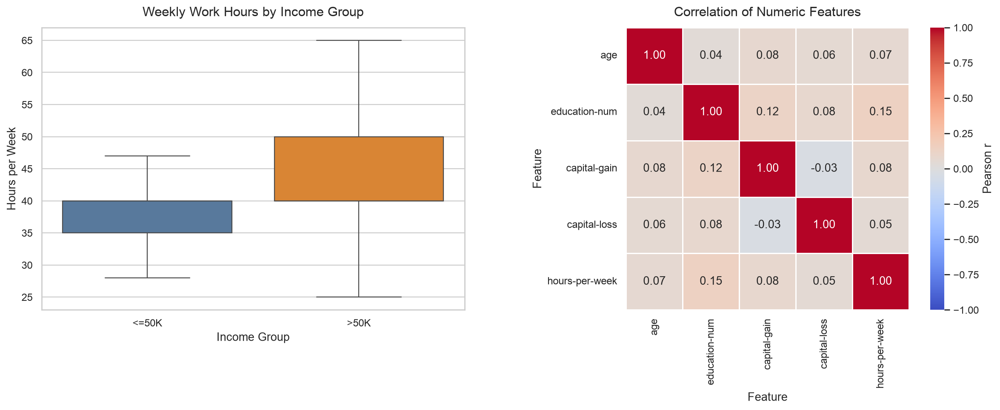

# Adult Census Income End-to-End 분석 보고서

- 자동 생성 시각: 2026-07-21 16:26:59 KST
- 데이터 출처: UCI Adult Census Income
- 원본 URL: https://archive.ics.uci.edu/ml/machine-learning-databases/adult/adult.data
- 실행에 사용한 파일: `/Users/lim/data-project/adult.data.txt`
- 타깃: `income` (`<=50K`=0, `>50K`=1)

## 1. 데이터 준비 및 Pandas·Polars 비교

Pandas는 `na_values="?"`, `skipinitialspace=True`로 로딩했다. Polars도 같은 원본을
독립적으로 로딩한 뒤 문자열 공백과 `?`를 결측치로 정규화했다. 중복 행은 첫 행을
남기고 제거했으며, `workclass`, `occupation`, `native-country`의 결측치는 행을
삭제하지 않고 각 컬럼의 최빈값으로 대체했다.

| 처리 항목 | Pandas | Polars |
| --- | --- | --- |
| 원본 행 수 | 32561 | 32561 |
| 원본 결측치 수 | 4262 | 4262 |
| 제거한 중복 행 수 | 24 | 24 |
| 정제 후 행 수 | 32537 | 32537 |
| 정제 후 결측치 수 | 0 | 0 |

### 결측치 처리

| 컬럼 | 처리 전 | 대체 최빈값 | 처리 후 |
| --- | --- | --- | --- |
| workclass | 1836 | Private | 0 |
| occupation | 1843 | Prof-specialty | 0 |
| native-country | 583 | United-States | 0 |

## 2. 기술통계

`fnlwgt`는 인구총조사 가중치이므로 팀 SPEC에 따라 상관분석과 ML feature에서 제외했다.

| 수치형 변수 | mean | std | 25% | 50% | 75% |
| --- | --- | --- | --- | --- | --- |
| age | 38.5855 | 13.6380 | 28.0000 | 37.0000 | 48.0000 |
| education-num | 10.0818 | 2.5716 | 9.0000 | 10.0000 | 12.0000 |
| capital-gain | 1078.4437 | 7387.9574 | 0.0000 | 0.0000 | 0.0000 |
| capital-loss | 87.3682 | 403.1018 | 0.0000 | 0.0000 | 0.0000 |
| hours-per-week | 40.4403 | 12.3469 | 40.0000 | 40.0000 | 45.0000 |

## 3. 상관계수

| 변수 | age | education-num | capital-gain | capital-loss | hours-per-week |
| --- | --- | --- | --- | --- | --- |
| age | 1.0000 | 0.0362 | 0.0777 | 0.0577 | 0.0685 |
| education-num | 0.0362 | 1.0000 | 0.1227 | 0.0799 | 0.1484 |
| capital-gain | 0.0777 | 0.1227 | 1.0000 | -0.0316 | 0.0784 |
| capital-loss | 0.0577 | 0.0799 | -0.0316 | 1.0000 | 0.0542 |
| hours-per-week | 0.0685 | 0.1484 | 0.0784 | 0.0542 | 1.0000 |

## 4. 시각화

### Seaborn 정적 차트

좌측은 income 그룹별 주당 근로시간 분포(t-test 대상 변수), 우측은 수치형 5개
변수의 상관계수 히트맵이다.

### Plotly 인터랙티브 차트

[교육수준·소득그룹별 평균 주당 근로시간 열기](eda_chart_plotly.html)

## 5. Welch's t-test

- 비교: `income <=50K`와 `income >50K` 그룹의 `hours-per-week` 평균
- `<=50K` 평균: 38.8429
- `>50K` 평균: 45.4734
- t-statistic: -45.095026
- p-value: < 1e-300 (부동소수점 정밀도 한계)
- 해석: **p < 0.05 → 두 income 그룹의 hours-per-week 평균 차이는 통계적으로 유의미하다.**

## 6. ML Pipeline

- 전처리: 수치형 중앙값 대체 + 표준화, 범주형 최빈값 대체 + One-Hot Encoding
- 모델: Logistic Regression
- 분할: `test_size=0.2`, `random_state=42`, stratified split
- 학습 행 수: 26,029
- 평가 행 수: 6,508
- Accuracy: **0.8565**
- F1-score (`>50K`): **0.6757**
- 저장 모델: `model.joblib`

## 7. 분석 의견 및 개선 방향

- `>50K` 그룹의 평균 주당 근로시간은 45.47시간으로,
  `<=50K` 그룹의 38.84시간보다 높다.
- t-test는 두 그룹 평균 차이의 통계적 유의성을 보여주지만 인과관계를 증명하지는 않는다.
- 본 모델은 해석과 재현성이 좋은 기준 모델이다. 향후 교차검증, 클래스 불균형 대응,
  트리 기반 모델과의 비교로 F1-score를 개선할 수 있다.
- 데이터셋에는 성별·인종 등 민감 특성이 포함되어 있으므로 서비스 적용 전 그룹별
  성능과 공정성 지표를 별도로 점검해야 한다.

## 8. 자동 생성 산출물

- `eda_chart_seaborn.png`
- `eda_chart_plotly.html`
- `model.joblib`
- `report.md`

이 문서는 `main.py` 실행 결과로 자동 생성되었으며 수동 계산값을 포함하지 않는다.
